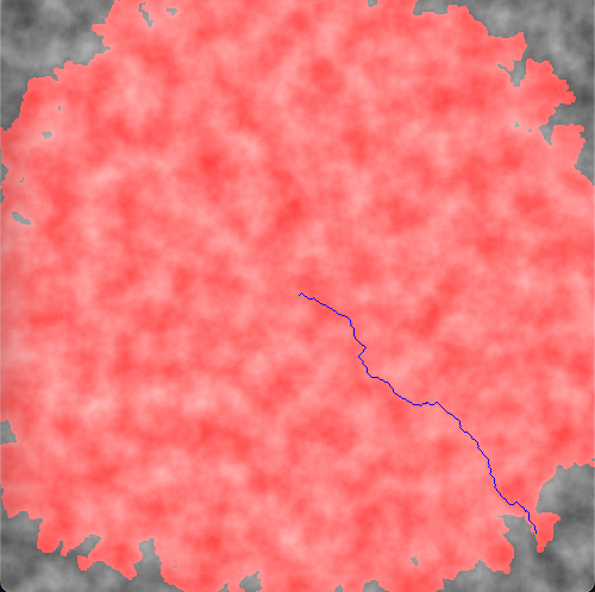
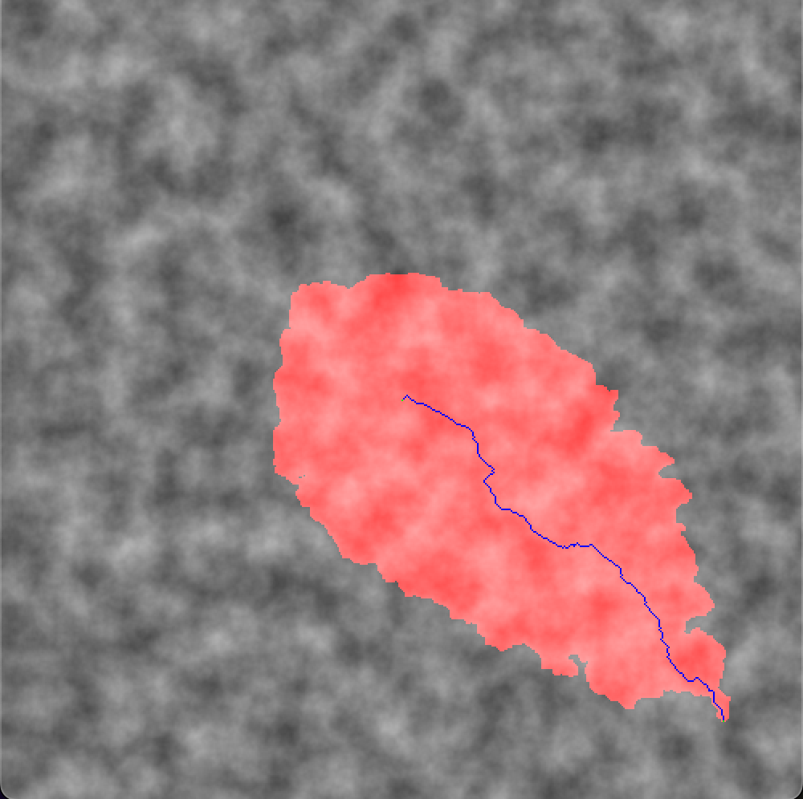

# A* 알고리즘 시뮬레이션

A* 알고리즘은 주어진 출발 꼭짓점에서부터 목표 꼭짓점까지 가는 최단 경로를 찾아내는 알고리즘입니다. 적절한 휴리스틱을 가지고 이 알고리즘을 사용하면 데이크스트라 알고리즘보다 훨씬 더 적은 꼭짓점들을 보고 최단 경로를 찾을 수 있습니다.

## 시뮬레이션

시뮬레이션을 실행하면 직사각형 그리드 위에 2차원 세계를 무작위로 만듭니다. 세계의 각 점은 0에서 255 사이의 정수 값으로 표현되는 높이를 가집니다.
점 사이를 이동하는 비용은 점 간의 높이 차이에 따라 달라집니다. 두 점이 인접한다고 가정하면, p1에서 p2로 이동하는 비용은
`e ^ (p2의 높이 - p1의 높이)` 입니다. 즉, p2의 높이가 p1보다 크면, 오르막길이라서 비용이 큽니다. 하지면, p2의 높이가 p1보다 작으면, 내리막길이라서
비용이 적습니다.

총 세 개의 경로 알고리즘으로 시뮬레이션을 실행할 수 있습니다.

* `Stupid`: 브루트 포스 알고리즘
* `Dijkstra`: 데이크스트라 알고리즘
* `AStar`: A* 알고리즘

## 결과

### `Stupid`

`PathCost, 1373.80078125, Uncovered, 401, TimeTaken, 2`

브루트 포스 알고리즘으로 시뮬레이션한 결과입니다. 이 알고리즘은 목표에 도달하기 데 필요한 만큼 수직으로 이동한 다음 수평으로 이동합니다. 즉, 점들 사이의 비용을 무시합니다.

파란 줄은 알고리즘이 선택한 경로입니다.
경로의 비용은 약 1373이고 총 401개의 점을 봤습니다. 선택한 경로 이외에 다른 점들을 보지 않아서, 속도가 가장 빠릅니다. 하지만 최단 경로를 찾아내지 못합니다.

### `Dijkstra`

`PathCost, 388.875, Uncovered, 222929, TimeTaken, 11146`

데이크스트라 알고리즘으로 시뮬레이션한 결과입니다. 빨간색으로 칠해져 있는 부분은 최단 경로를 파악하기 위해서 봐야 했던 점들입니다. 보다시피, 최단 경로를 찾았지만, 많은 점을 봐야 해서 비효율적입니다.

### `AStar`

`PathCost, 388.875, Uncovered, 47467, TimeTaken, 8564`

A* 알고리즘으로 시뮬레이션한 결과입니다. 데이크스트라 알고리즘보다 훨신 적은 점을 보고도 최단 경로를 찾았습니다.

## 실행하는 법

1. `make`으로 컴파일 하기.

2. `java Main -w <세계 너비> -h <세계 높이> <1개 이상의 경로 알고리즘>`

    * `java Main -w 500 -h 500 Stupid Dijkstra AStar`

3. `make clean`으로 컴파일된 파일 지우기.
